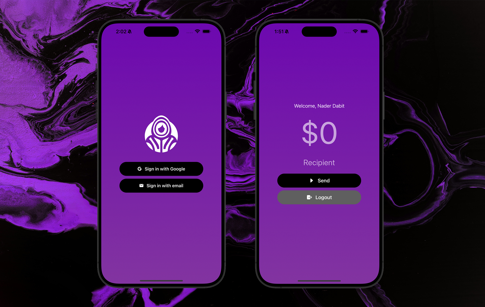

## Cross-platform On-chain Payments with Social Login and account abstraction

Built with Privy wallet, Biconomy, and Airstack



### To build this app

1. Clone the repo

2. Install dependencies

3. Set up API keys and other configuration in `.env` file (see `.env.example`)

This includes API keys from Biconomy, Privy, and Airstack

4. Run the app

```sh
npm start
```
